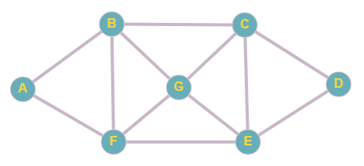

# grafo-euleriano-hamiltoniano
 Algoritmo que verifica se um grafo é Euleriano e/ou Hamiltoniano.

 Integrantes do projeto: Brener Augusto de Oliveira e Bruno Butka.
 Disciplina: Estrutura de Dados 2.

 Grafo Euleriano (7 vértices)
 </img>