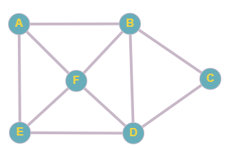
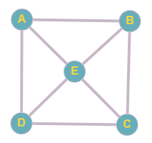
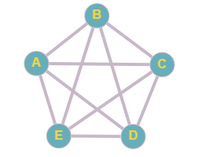
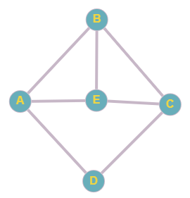
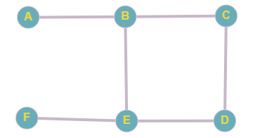

# Grafos Euleriano e Hamiltoniano
 Algoritmo que verifica se um grafo é Euleriano e/ou Hamiltoniano.

 **Integrantes do projeto:** Brener Augusto de Oliveira e Bruno Butka.
 
 **Disciplina:** Estrutura de Dados 2.
  

 **Grafo Euleriano (7 vértices)**
 
 </img>
    
 **Grafo Semi-euleriano (6 vértices)**
 
 </img>
    
 **Grafo Não Euleriano (5 vértices)**
 
 </img>
    
 **Grafo Hamiltoniano (5 vértices)**
 
 </img>
    
 **Grafo Hamiltoniano (5 vértices)**
 
 </img>
    
 **Grafo Não Hamiltoniano (6 vértices)**
 
 </img>
 

